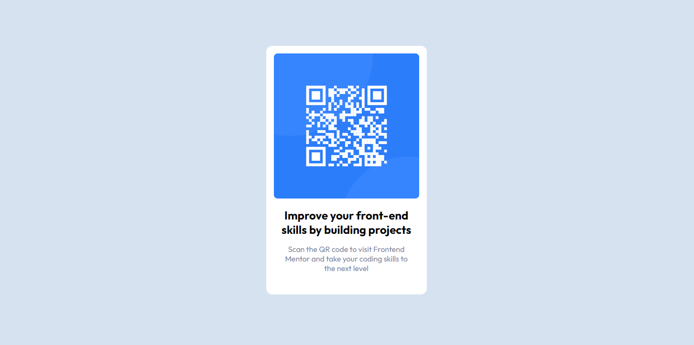

# Frontend Mentor - QR code component solution

This is a solution to the [QR code component challenge on Frontend Mentor](https://www.frontendmentor.io/challenges/qr-code-component-iux_sIO_H). Frontend Mentor challenges help you improve your coding skills by building realistic projects.

## Table of contents

- [Overview](#overview)
  - [Screenshot](#screenshot)
  - [Links](#links)
- [My process](#my-process)
  - [Built with](#built-with)
  - [What I learned](#what-i-learned)
  - [Continued development](#continued-development)
  - [Useful resources](#useful-resources)
- [Author](#author)
- [Acknowledgments](#acknowledgments)

## Overview

This is a beginner friendly project from Frontend Mentor.

### Screenshot

### Links

- Solution URL: [Add solution URL here](https://your-solution-url.com)
- Live Site URL: [Add live site URL here](https://your-live-site-url.com)

### Built with

- Semantic HTML5 markup
- CSS custom properties
- Flexbox
- Mobile-first workflow

### What I learned

I identified three different ways to set background color on the entire page

1.  setting 100vh on a "container"
2.  setting html, body to 100% and the actual "container" to 100%
    eg.
    body, html{
    margin: 0;
    height: 100%;
    }
    .holder{
    height: 100%;
    background-color: rgb(156, 6, 6);
    }

3.  setting "container"'s prosition to absolute. top: 0, bottom:0, left: 0, right: 0
    e.g. container{
    position: absolute;
    top: 0,
    bottom: 0;
    right: 0;
    left: 0;
    }

## Author

- Website - Kwaku TD. (https://github.com/syntaCorp)
- Frontend Mentor - [@cyberstrong](https://www.frontendmentor.io/profile/syntaCorp)

### Useful resources

- [SoftAuthor](https://softauthor.com/) - This helped me on creative ways to set fullscreen height.
